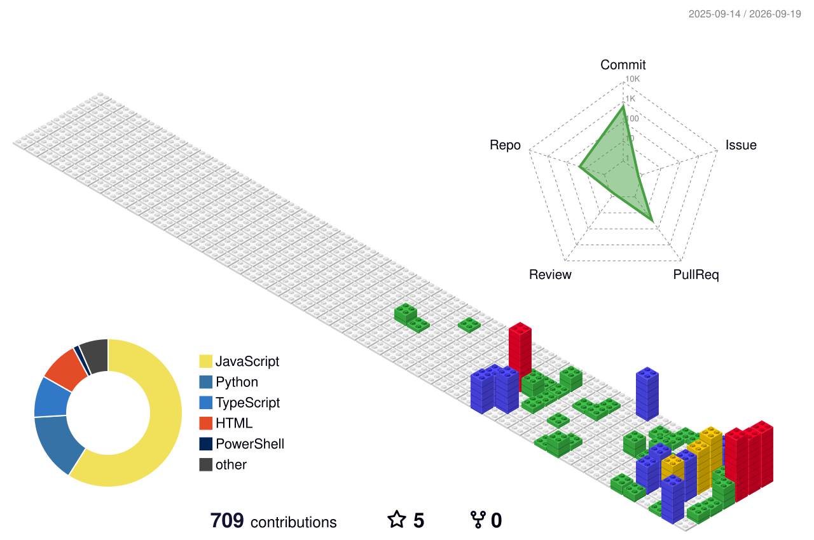

<!--
  GitHub Profile README — Editorial Brutalist Sketchbook
  GitHub-safe Markdown: no scripts, no custom CSS, no unsupported embeds.
-->

# DEVGNA VYAS

**Software Developer · Android / Backend / Web · Linux + Network Security Focus**

`VOL. 01 · NADIAD, INDIA · CHARUSAT / CMPICA · BCA 2026 · SYSTEMS-FIRST ENGINEERING`

---

## FIELD NOTES

I build practical software across **mobile UX**, **backend reliability**, **static-first web apps**, **Linux tooling**, and **network/security systems**. My work usually starts from the parts that decide whether a product survives real usage: authentication, sessions, deployment constraints, offline behavior, data flow, performance, and failure paths.

I am currently a **BCA student at CHARUSAT / CMPICA, Batch of 2026**, and a co-author of a Springer CCIS conference paper on lightweight network intrusion detection for ARM edge environments.

> **Operating principle:** keep the interface simple, keep the system understandable, and make the engineering strong enough that the user never has to think about it.

---

## CONTRIBUTION TERRAIN

<!--
  3D assets are generated by .github/workflows/profile-3d.yml.
  Do not edit generated SVG files manually; change workflow/config instead.
-->

<picture>
  <source media="(prefers-color-scheme: dark)" srcset="./profile-3d-contrib/profile-night-rainbow.svg">
  
</picture>

<strong>Auto-generated field map:</strong> GitHub Actions rebuilds these SVG assets from the contribution graph and commits updates back into this profile repository.

---

## PROJECT INDEX

### `ez-drop`

**Purpose:** Browser-to-browser file and text transfer through a static web app.

- **Stack:** HTML, CSS, JavaScript, WebRTC, QR pairing, Service Worker
- **Technical focus:** 5-digit room codes, QR/manual pairing, direct peer transfer, installable PWA shell, no backend server
- **Status:** Live / actively improving
- **Links:** [Live App](https://vyas-devgna.github.io/ez-drop/) · [Repository](https://github.com/vyas-devgna/ez-drop)

---

### `Tutoring`

**Purpose:** Live programming and exam-prep landing page for college students.

- **Stack:** HTML, CSS, JavaScript, GitHub Pages
- **Technical focus:** responsive service layout, pricing/package clarity, enquiry flow, exam-prep positioning, static deployment
- **Status:** Live
- **Links:** [Live Site](https://vyas-devgna.github.io/Tutoring/) · [Repository](https://github.com/vyas-devgna/Tutoring)

---

### `Portfolio`

**Purpose:** Personal engineering portfolio with projects, research, writing, and contact flow.

- **Stack:** HTML, CSS, JavaScript, static GitHub Pages deployment
- **Technical focus:** editorial visual identity, responsive sections, project case-study presentation, static-first maintainability
- **Status:** Live
- **Links:** [Live Site](https://vyas-devgna.github.io/Portfolio/) · [Repository](https://github.com/vyas-devgna/Portfolio)

---

### `Same.Energy Android Client`

**Purpose:** Flutter Android client for Same.Energy's visual search experience.

- **Stack:** Flutter, Dart, Riverpod, GoRouter, Dio, Secure Storage
- **Technical focus:** Clean Architecture, reactive state boundaries, API integration, authentication/security, image-heavy mobile UI, caching/offline behavior
- **Role:** Technical architecture and Flutter implementation contributor
- **Status:** Open-source fork / mobile client
- **Links:** [Repository](https://github.com/vyas-devgna/same-energy-android)

---

### `Smart Attendance System`

**Purpose:** Secure attendance verification system designed to reduce proxy marking and location spoofing.

- **Stack:** Go, Gin, Flutter, PostgreSQL, Redis, WebSockets, QR verification, face liveness, BLE proximity
- **Technical focus:** JWT/RBAC, audit logs, rotating signed QR codes, real-time admin dashboard, report generation, multi-factor physical-presence verification
- **Status:** Academic / private system design and implementation work
- **Links:** Mentioned in portfolio and project documentation

---

## RESEARCH / WRITING

### HERMES: Hybrid AI/ML Network Security on ARM Edge Clusters

**Publication:** Springer CCIS · icSoftComp 2025  
**Authors:** Arpankumar G. Raval, Devgna Vyas  
**Theme:** Lightweight network intrusion detection for low-power edge environments

HERMES combines a rule-based filtering layer with compact ML inference for ARM-based edge nodes. The work focuses on making intrusion detection practical under real deployment constraints: limited power budget, small hardware, network throughput, and model efficiency.

| Signal | Detail |
|---|---|
| Domain | Network intrusion detection, edge security, ARM systems |
| Core idea | Hybrid signature filtering + compact ML classifier |
| Platform focus | Low-power ARM / edge cluster environments |
| Publication venue | Soft Computing and Its Engineering Applications, Springer CCIS |
| DOI | [10.1007/978-3-032-22062-2_24](https://doi.org/10.1007/978-3-032-22062-2_24) |

---

## TECHNICAL TOOLBOX

### Languages

### Mobile / Frontend

### Backend / Data

### Systems / Security / Tools

---

## CURRENT SIGNAL

- Building **static-first web apps** that deploy cleanly on GitHub Pages.
- Improving **PWA/WebRTC utilities** with simpler UI and faster connection logic.
- Keeping **Tutoring** live as a practical service page for programming and exam preparation.
- Exploring **Linux systems**, security tooling, and low-overhead network defense.
- Refining **Flutter client architecture** for fast, polished Android experiences.

---

## ACTIVITY / METRICS

<strong>Open additional GitHub stats</strong>

 

  
  

---

## BUILD LOG

| Area | What I care about |
|---|---|
| Backend | clean APIs, predictable auth, session handling, reliable data flow |
| Mobile | responsive UI, offline behavior, state management, secure storage |
| Web | static deployment, GitHub Pages, PWA installability, no-backend utilities |
| Security | protocol thinking, network inspection, anti-spoofing, auditability |
| Systems | Linux workflows, automation, low-complexity engineering |
| Teaching | practical explanations, exam-focused structure, beginner-friendly project guidance |

---

## SUPPORT ME

  <a href="https://github.com/sponsors/vyas-devgna" target="_blank" title="Sponsor vyasdevgna on GitHub" style="display:inline-flex;flex-direction:column;align-items:center;justify-content:center;background:#ffffff;padding:8px 32px;border-radius:16px;text-decoration:none;border:1px solid #e5e7eb;box-shadow:0 4px 6px -1px rgba(0,0,0,0.05), 0 2px 4px -2px rgba(0,0,0,0.05);transition:transform 0.2s;">@vyas-devgna</a>
  &nbsp;&nbsp;&nbsp;&nbsp;
  <a href="https://chai4.me/vyasdevgna" target="_blank" title="Support vyasdevgna on Chai4Me" style="display:inline-flex;flex-direction:column;align-items:center;justify-content:center;background:#ffffff;padding:8px 32px;border-radius:16px;text-decoration:none;border:1px solid #e5e7eb;box-shadow:0 4px 6px -1px rgba(0,0,0,0.05), 0 2px 4px -2px rgba(0,0,0,0.05);transition:transform 0.2s;">@vyasdevgna</a>

  <a href="https://vyas-devgna.github.io/Portfolio/donate.html"><strong>Support page →</strong></a>

---

## CONTACT

**Open to:** internships, freelance web/mobile work, backend systems, academic software, security-focused engineering discussions, tutoring enquiries, and practical project collaborations.

- Portfolio: [vyas-devgna.github.io/Portfolio](https://vyas-devgna.github.io/Portfolio/)
- Support: [vyas-devgna.github.io/Portfolio/donate.html](https://vyas-devgna.github.io/Portfolio/donate.html)
- Tutoring: [vyas-devgna.github.io/Tutoring](https://vyas-devgna.github.io/Tutoring/)
- GitHub: [github.com/vyas-devgna](https://github.com/vyas-devgna)
- LinkedIn: [linkedin.com/in/devgna-vyas](https://linkedin.com/in/devgna-vyas)
- Email: [vyasdevgna@gmail.com](mailto:vyasdevgna@gmail.com)
- Research: [HERMES on Springer](https://doi.org/10.1007/978-3-032-22062-2_24)

---

`FIELD NOTE END · BUILD SMALL · SHIP CLEAN · UNDERSTAND THE SYSTEM`

