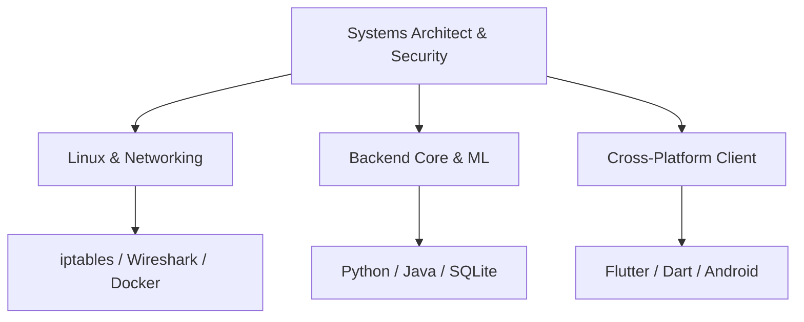
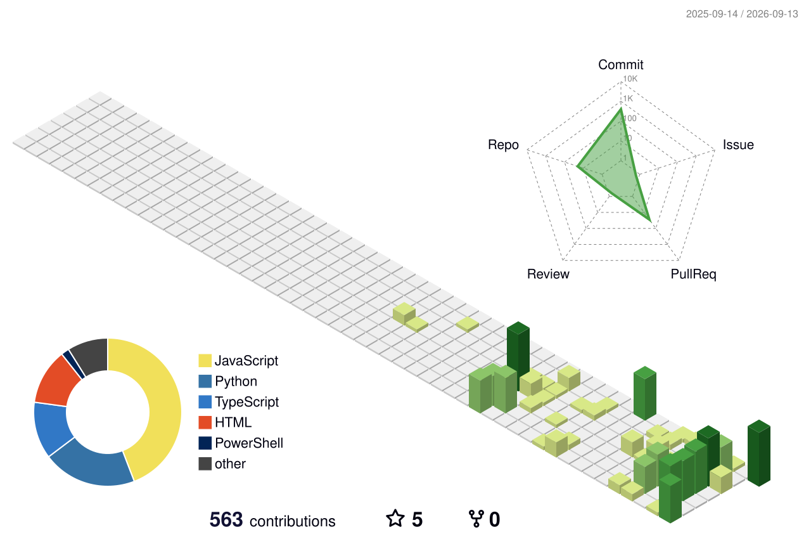

<!-- Header Banner: Wave Gradient Style -->

  

<!-- Dynamic Typing Effect Subtitle -->

  

<!-- Sleek Flat Interaction Badges -->

  
  
  

<!-- 1. EXECUTIVE PITCH / BIO -->
## 🔭 Executive Brief

I am a systems-focused developer and security researcher specializing in the intersection of **hybrid network security**, **Linux infrastructure**, and **cross-platform client applications**. Currently pursuing my **BCA** at **CHARUSAT / CMPICA**, my engineering philosophy is rooted in optimization: building robust, lightweight, and low-latency code for secure edge environments.

- 🛡️ **Primary Focus**: Designing network intrusion detection systems, custom ARM cluster orchestrations, and Linux kernel hardening.
- 📱 **Client Engineering**: Architecting premium, state-managed applications using Flutter and Dart.
- 🔬 **Research & Standards**: Developing AI-driven network intelligence models for resource-constrained architectures.

---

<!-- 2. PUBLISHED RESEARCH SPOTLIGHT -->
## 🔬 Published Research

> [!IMPORTANT]
> ### [HERMES: Design and Deployment of a Hybrid AI/ML Network Security System on ARM Clusters for Edge Environments](https://www.researchgate.net/profile/Devgna-Vyas)
> **Published in Springer CCIS Series — Presented at icSoftComp 2025**  
> *Co-Authored with Prof. Arpankumar G. Raval*
> 
> * **The Core Breakthrough**: Designed a lightweight, hybrid network security paradigm that pairs high-throughput signature filtering with a quantized Deep Neural Network (DNN) classifier.
> * **Hardware Target**: Optimized explicitly for resource-constrained ARM-based edge clusters, ensuring real-time inline detection without performance degradation.
> * **Key Results**: Achieved sub-millisecond classification latencies and a significant reduction in false-positive rates compared to traditional edge firewalls.

---

<!-- 3. FEATURED CODEBASES -->
## 🛠️ Featured Engineering Projects

<table width="100%">
  <tr>
    <td width="50%" valign="top">
      <h3>🚀 Same.Energy Android Client</h3>
      
A native-feeling, gesture-optimized Android client for the <a href="https://same.energy/">Same.Energy</a> semantic visual search engine.

      <ul>
        <li><strong>Tech Stack:</strong> Flutter, Dart, Restful API Integration.</li>
        <li>Custom physics-based grid animations and multi-directional scrolling.</li>
        <li>Memory-efficient image caching and asynchronous network pipeline.</li>
      </ul>
      
<a href="https://github.com/vyas-devgna">View Repository →</a>

    </td>
    <td width="50%" valign="top">
      <h3>🏫 CHARUSAT eGov App</h3>
      
The official mobile interface for the Charotar University of Science and Technology administrative portal.

      <ul>
        <li><strong>Tech Stack:</strong> Flutter, Dart, Android SDK, JWT-Auth.</li>
        <li>Features secure real-time grade checking, course registrations, and notifications.</li>
        <li>Encrypted secure storage for sensitive credentials.</li>
      </ul>
      
<a href="https://github.com/vyas-devgna">View Repository →</a>

    </td>
  </tr>
  <tr>
    <td width="50%" valign="top">
      <h3>🔒 Smart Attendance System</h3>
      
An automated, tamper-proof attendance environment using computer vision and local IoT protocols.

      <ul>
        <li><strong>Tech Stack:</strong> Python, OpenCV, SQLite, BLE.</li>
        <li>Automated facial recognition and local Bluetooth triangulation to prevent location spoofing.</li>
        <li>Optimized low-overhead database indexing for sub-second check-in processing.</li>
      </ul>
      
<a href="https://github.com/vyas-devgna">View Repository →</a>

    </td>
    <td width="50%" valign="top">
      <h3>🐧 Linux SysOps & Labs</h3>
      
A collection of custom scripts, server profiles, and kernel hardening scripts compiled during network security audits.

      <ul>
        <li><strong>Tech Stack:</strong> Bash, Docker, Wireshark, iptables.</li>
        <li>Automated vulnerability scanning scripts and system telemetry hooks.</li>
        <li>Containerized lab structures for networking and intrusion analysis.</li>
      </ul>
      
<a href="https://github.com/vyas-devgna">View Repository →</a>

    </td>
  </tr>
</table>

---

<!-- 4. DYNAMIC SKILLS TIERS -->
## 💻 Core Technology Stack

### 📂 Structural Breakdown

| Layer | Technologies & Frameworks | Tools & Platforms |
| :--- | :--- | :--- |
| **Systems & Sec** | `C` • `Bash` • `TCP/IP` • `Linux (Arch/Debian)` | `Docker` • `Wireshark` • `Nmap` • `Git` • `IPtables` |
| **Backend & Logic** | `Python` • `Java` • `JavaScript` • `SQL` | `Node.js` • `SQLite` • `TensorFlow Lite` |
| **Mobile & Client** | `Dart` • `Flutter` • `Android Native` | `Material Design` • `BLoC Pattern` • `REST Client` |

---

<!-- 5. INTERACTIVE ACTIVITY HUB -->
## 📊 Development Activity & Metrics

<table width="100%">
  <tr>
    <td width="50%" valign="top">
      <h4>⚡ Real-time GitHub Stats</h4>
      
    </td>
    <td width="50%" valign="top">
      <h4>🔥 Current Coding Streak</h4>
      
    </td>
  </tr>
  <tr>
    <td width="50%" valign="top">
      <h4>🗂️ Language Distribution</h4>
      
    </td>
    <td width="50%" valign="top">
      <h4>🧬 Isometric Contribution Grid</h4>
      <!-- Automatically generated by .github/workflows/profile-3d.yml -->
      
    </td>
  </tr>
</table>

### 🎮 Contribution Snake Grid
<!-- Automatically generated by .github/workflows/snake.yml -->
<picture>
  <source media="(prefers-color-scheme: dark)" srcset="./dist/github-contribution-grid-snake-dark.svg" />
  <source media="(prefers-color-scheme: light)" srcset="./dist/github-contribution-grid-snake.svg" />
  
</picture>

---

<!-- 6. CONTACT & OUTRO -->
## 📫 Let's Connect & Collaborate

  Let's build secure infrastructure or develop premium applications. You can contact me via the channels below:

  
  &nbsp;&nbsp;
  

  Designed with precision. Integrated with GitHub Actions. 🛡️

