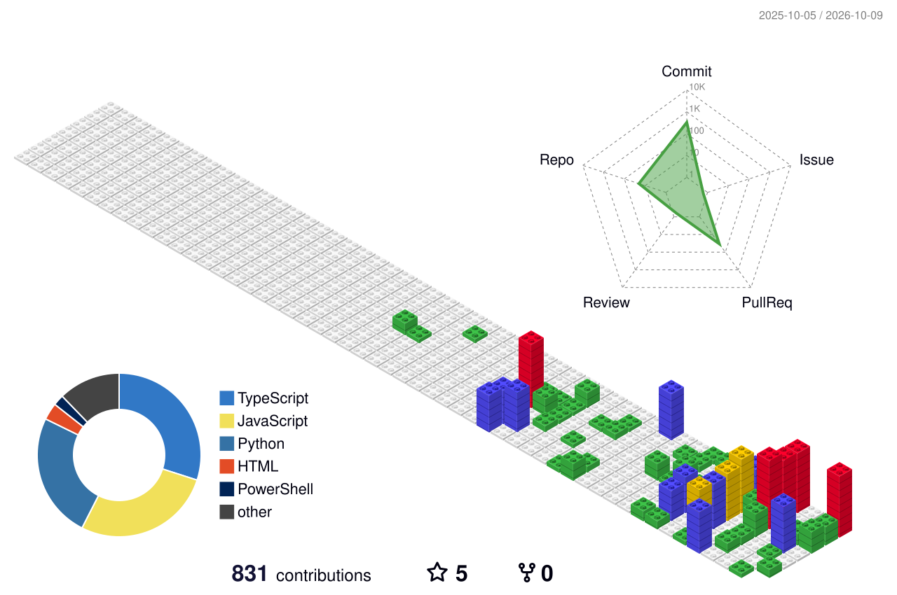

<!-- Header Section -->

  

 

  
<strong>Building practical software across agent infrastructure, local-first apps, mobile UX, backend reliability, Linux tooling, and network/security systems.</strong>

 

I’m **Devgna Vyas**, also listed as **Vyas Devgna**. Explore my [official portfolio](https://vyasdevgna.online/) for projects and research, and [Devgna Vyas Blog](https://blog.vyasdevgna.online/) for essays on systems engineering, AI agent security, networking, and open source.

## 🔬 Research & Principles

- **HERMES (Edge Security):** Co-author of a Springer CCIS conference paper (*icSoftComp 2025*) on lightweight network intrusion detection (Hybrid AI/ML) for ARM edge environments. 
- **Operating Principle:** Keep the interface simple, keep the system understandable, and make the engineering strong enough that the user never has to think about it.

---

## 🛠️ Technical Arsenal

<strong>Languages & Frameworks</strong>

 

  
  
  
  
  
  
  

<strong>Backend, Databases & Systems</strong>

 

  
  
  
  
  
  

---

## 🚀 Key Projects

<table>
  <tr>
    <td width="50%">
      <h3><a href="https://github.com/vyas-devgna/liwm-agent-framework">🧠 LIWM</a></h3>
      
Auditable, provenance-gated intent and memory infrastructure for coding agents.

    </td>
    <td width="50%">
      <h3><a href="https://github.com/vyas-devgna/braids">🧬 Braids</a></h3>
      
Engineering rigor for coding agents: evidence, fallbacks, failure paths and verification.

    </td>
  </tr>
  <tr>
    <td width="50%">
      <h3><a href="https://github.com/vyas-devgna/ezboard">🎨 EzBoard</a></h3>
      
Private collaborative canvas for people and AI agents built with local-first WebRTC.

    </td>
    <td width="50%">
      <h3><a href="https://github.com/vyas-devgna/same-energy-android">🔍 Same.Energy Android</a></h3>
      
A native-feeling semantic image-search client built with Flutter.

    </td>
  </tr>
  <tr>
    <td width="50%">
      <h3><a href="https://github.com/vyas-devgna/ez-drop">⚡ ez-drop</a></h3>
      
Browser-to-browser file and text transfer using WebRTC.

    </td>
    <td width="50%">
      <h3><a href="https://github.com/vyas-devgna/beatblocks-control">🎶 BeatBlocks Control</a></h3>
      
Minecraft-side music control through a local Spicetify bridge.

    </td>
  </tr>
</table>

---

## 📈 GitHub Metrics & Streaks

<picture>
  <source media="(prefers-color-scheme: dark)" srcset="https://github-readme-stats-eight-theta.vercel.app/api?username=vyas-devgna&amp;show_icons=true&amp;hide_border=true&amp;rank_icon=github&amp;theme=github_dark&amp;bg_color=00000000">
  
</picture>
&nbsp;
<picture>
  <source media="(prefers-color-scheme: dark)" srcset="https://github-readme-streak-stats.herokuapp.com/?user=vyas-devgna&amp;hide_border=true&amp;theme=github-dark&amp;background=00000000">
  
</picture>
 
<picture>
  <source media="(prefers-color-scheme: dark)" srcset="https://github-readme-stats-eight-theta.vercel.app/api/top-langs/?username=vyas-devgna&amp;layout=compact&amp;hide_border=true&amp;theme=github_dark&amp;bg_color=00000000">
  
</picture>

---

## 🌍 Contribution Terrain

 

<picture>
  <source media="(prefers-color-scheme: dark)" srcset="./profile-3d-contrib/profile-night-rainbow.svg">
  
</picture>

<strong>Auto-generated field map:</strong> GitHub Actions rebuilds these SVG assets from the contribution graph.

---

  <h3>💖 Support My Work</h3>
  
  &nbsp;&nbsp;&nbsp;
  

 

  

